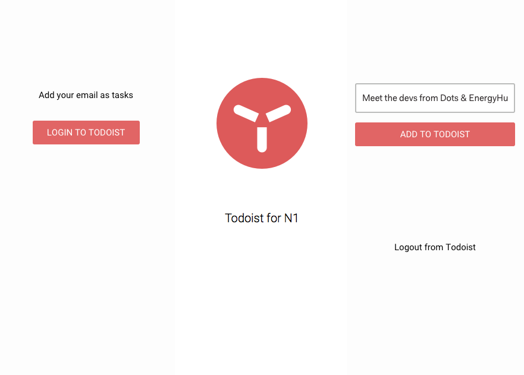

# TodoistN1
Todoist Plugin for N1- add email as tasks

Screens

# Installing

1. [Download](https://nylas.com/n1) Nylas N1 email client if you have not yet
2. [Get](https://github.com/anopensourceguy/TodoistN1/releases) the latest release of TodoistN1
3. Extract TodoistN1 and load N1
4. Edit the file my-message-sidebar.cjsx and add client id, client secret and redirect uri of a todoist developer app 
5. From the menu, select `Developer > Install a Package Manually...` from the dialog, choose the directory of this plugin to install it
