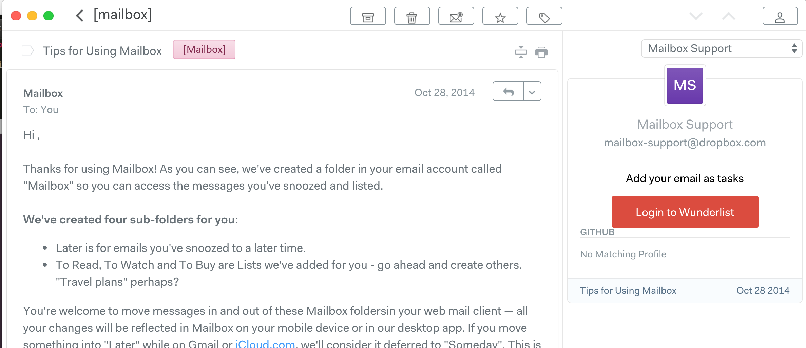
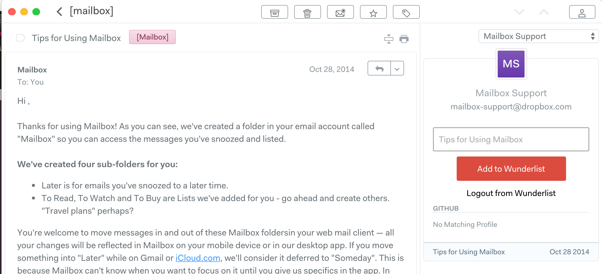

# WunderlistN1
Wunderlist Plugin for N1- add email as tasks

# Screens

# Installing

1. [Download](https://nylas.com/n1) Nylas N1 email client if you have not yet.
2. [Get](https://github.com/sornon1/WunderlistN1/releases) the latest release of WunderlistN1.
3. Set up a [Wunderlist app](https://developer.wunderlist.com/apps) for linking to N1. You can set anything as the auth/redirect URL. 
3. Extract WunderlistN1 and load N1.
4. Edit the file wunderlist-sidebar.cjsx and add client id, client secret and redirect uri of the wunderlist app.
5. From the menu, select `Developer > Install a Package Manually...` from the dialog, choose the directory of this plugin to install it.
